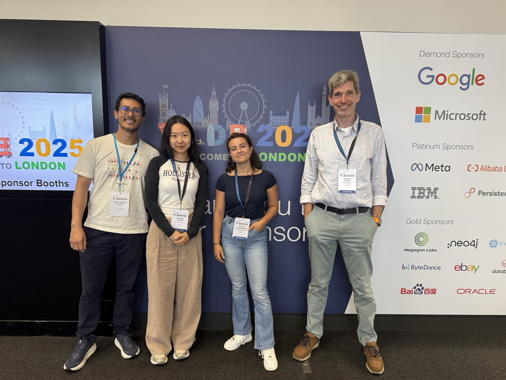

Hi! I'm a PhD student at the Privacy & Security Chair at KIT, in Germany. My background is in Mathematics. 
My current research interests lie in privacy-preserving data analysis, with a strong focus on Differential Privacy and location data.
I do not only like doing research, but also talking about it to both scientific and general audiences. 

Current Job
============

  <table>
    <tr>
      <td style="width:160px; vertical-align:top;">
        
      </td>
      <td>
        I'm a PhD student at the <strong>Chair of IT Security at KIT</strong> under the supervision of 
        <strong>Prof. Dr. Thorsten Strufe</strong>. Our research group is engaged in the development and 
        analysis of security and privacy concepts that protect from all types of potential attackers in the digital world.  We are part of the 
        <strong>KASTEL</strong>, as well as the excellence cluster <strong>CeTI</strong>.
      </td>
    </tr>
  </table>

News
======
<!-- TALK -->

  <!-- Columna izquierda: Q1 logo -->
  

  <!-- Columna derecha: título y autores -->
  

    <strong>
       Presenting our paper: Balancing Privacy and Utility in Correlated Data: A Study of Bayesian Differential Privacy
       at VLDB25 in London!
    </strong>

    

         51st International Conference on Very Large Data Bases 

    

    <!-- Recursos en cajitas -->
    

      <!-- Universidad -->
      
        📍 London, United Kingdom 
      

      <!-- Fecha -->
      
        ⏰ September 2025
      

      <!-- Slides -->
      <a href="../files/BayesianVLDB_slides.pdf" target="_blank" 
      style="background:#23AFA1; color:white; padding:0.2em 0.6em; border-radius:4px; text-decoration:none; font-size:13px; display:flex; align-items:center; gap:0.3em;">
  Slides
</a>
<!-- Poster -->
      <a href="../files/PosterVLDB2025.pdf" target="_blank" 
      style="background:#23AFA1; color:white; padding:0.2em 0.6em; border-radius:4px; text-decoration:none; font-size:13px; display:flex; align-items:center; gap:0.3em;">
  Poster
</a>
    

  

<!-- END TALK -->

<!-- TALK -->

  <!-- Columna izquierda: Q1 logo -->
  

  <!-- Columna derecha: título y autores -->
  

    <strong>
      Our Master thesis student Martin Lange awarded with the ‘Preis für den besten Studienabschluss 2024/2025’ 
    </strong>

    

        by KIT Informatics department 

    

    <!-- Recursos en cajitas -->
    

      <!-- Universidad -->
      
        📍 Karlsruhe, Germany
      

      <!-- Fecha -->
      
        ⏰ August 2025
      

      <!-- Slides -->
      <a href="../files/Utility_of_Semantic_Privacy_Notions_for_Correlated_Data.pdf" target="_blank" 
      style="background:#23AFA1; color:white; padding:0.2em 0.6em; border-radius:4px; text-decoration:none; font-size:13px; display:flex; align-items:center; gap:0.3em;">
  Thesis
</a>
<!-- Poster -->
      <a href="../files/PosterVLDB2025.pdf" target="_blank" 
      style="background:#23AFA1; color:white; padding:0.2em 0.6em; border-radius:4px; text-decoration:none; font-size:13px; display:flex; align-items:center; gap:0.3em;">
  Poster
</a>
    

  

<!-- END TALK -->

<!-- Older news colapsables -->

  

    Older News ↓
  

  <!-- TALK -->

  <!-- Columna izquierda: Q1 logo -->
  

  <!-- Columna derecha: título y autores -->
  

    <strong>
       Audience Award & Silver Medal at FameLab Regional Competition
    </strong>

    

         FameLab Regional Heat 

    

    <!-- Recursos en cajitas -->
    

      <!-- Universidad -->
      
        📍 Karlsruhe, Germany 
      

      <!-- Fecha -->
      
        ⏰ April 2024
      

      <!-- Slides -->
      <a href="https://www.youtube.com/watch?v=e0eyQMQ2fvU" target="_blank" 
      style="background:#23AFA1; color:white; padding:0.2em 0.6em; border-radius:4px; text-decoration:none; font-size:13px; display:flex; align-items:center; gap:0.3em;">
  Youtube Video
</a>
    

  

 <!-- TALK -->

  <!-- Columna izquierda: Q1 logo -->
  

  <!-- Columna derecha: título y autores -->
  

    <strong>
       Best Poster Award 2023
    </strong>

    

         Community Congress by Startupsecure 
    

    <!-- Recursos en cajitas -->
    

      <!-- Universidad -->
      
        📍 Karlsruhe, Germany 
      

      <!-- Fecha -->
      
        ⏰ May 2023
      
    

  

Miscellanea
======

  

    <h3>🏆 Awards</h3>
    <ul>
      <li>Silver medal and Audience Award in the <strong>FameLab Germany 2024</strong> regional heat</li>
      <li><strong>Best Poster Award 2023</strong> at <em>Community Congress by StartUpSecure</em></li>
      <li>Recognition for Best Records, <em>University of Santiago de Compostela</em></li>
    </ul>
  

  

    <h3>🧑‍💻 Reviewer for</h3>
    <ul>
      <li><em>IEEE Transactions on Information Forensics and Security (IEEE TIFS)</em></li>
      <li><em>ACM ASIA Conference on Computer and Communication Security (ASIACCS)</em></li>
      <li><em>European Symposium on Research in Computer Security (ESORICS)</em></li>
    </ul>
  

 

 <h3> 🌎 Collaborations & Research Stays</h3>
<!-- secret edit link: https://umap.openstreetmap.fr/en/map/anonymous-edit/1295508:ekt066q4--zlnzkGDDw1Q_ayi1dh-Bu-SMc4c5xJiMo-->

<iframe width="100%" height="300px" frameborder="0" allowfullscreen allow="geolocation" src="//umap.openstreetmap.fr/en/map/collaborations_1295508?scaleControl=false&miniMap=false&scrollWheelZoom=false&zoomControl=true&editMode=disabled&moreControl=false&searchControl=null&tilelayersControl=null&embedControl=null&datalayersControl=true&onLoadPanel=none&captionBar=false&captionMenus=false&homeControl=false#5/42.066/-1.230"></iframe>

Contact
======
I am always happy to discuss the possibility of new collaborations and research ideas.
  - mail patricia.balboa at kit.edu
  
------

