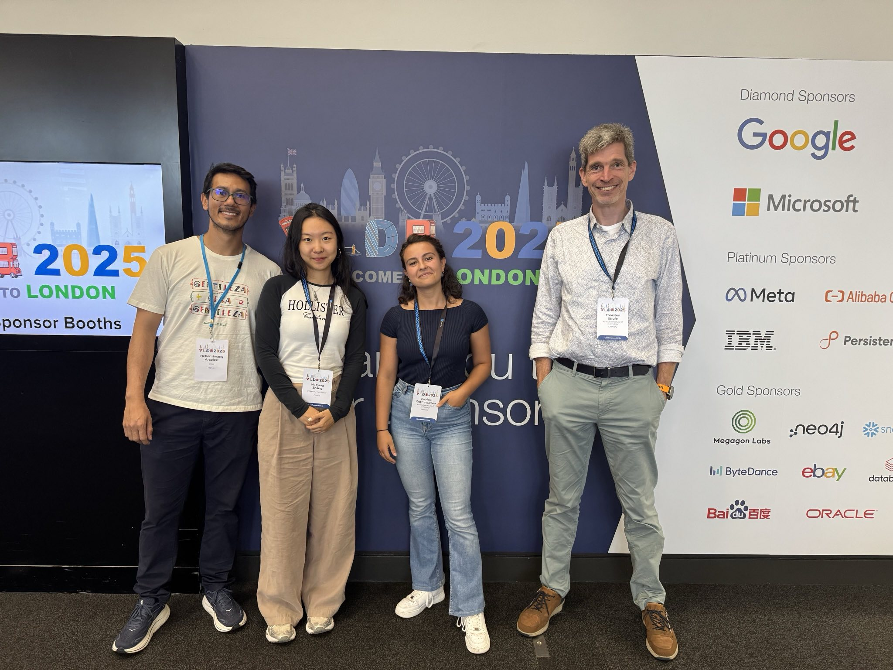
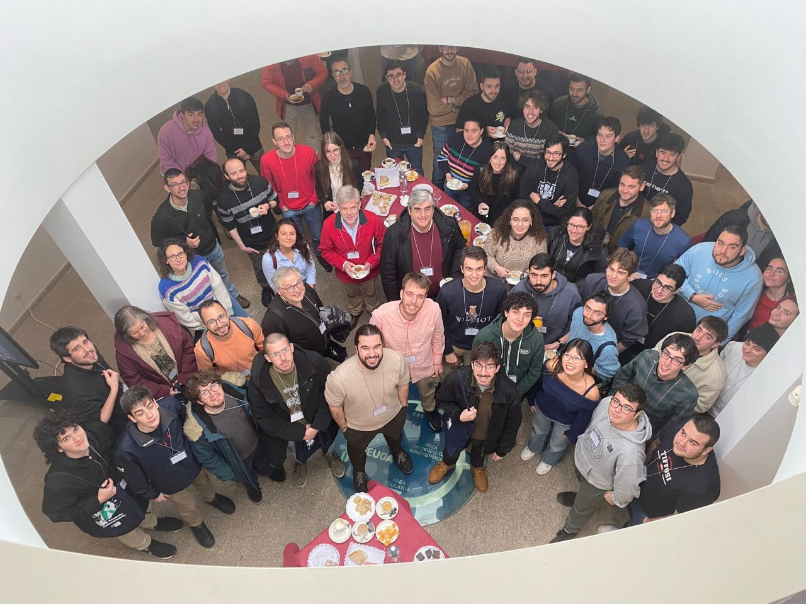
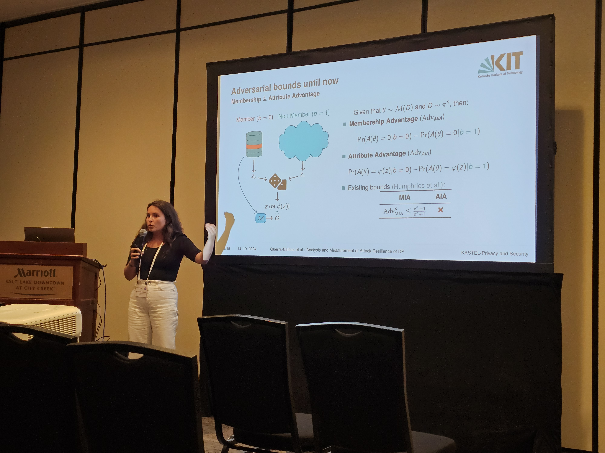
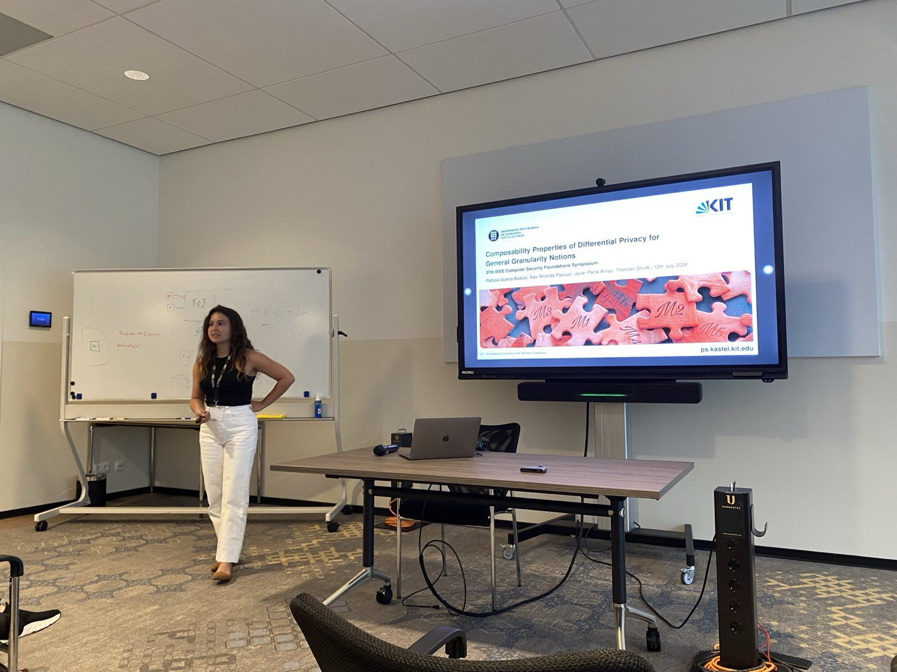
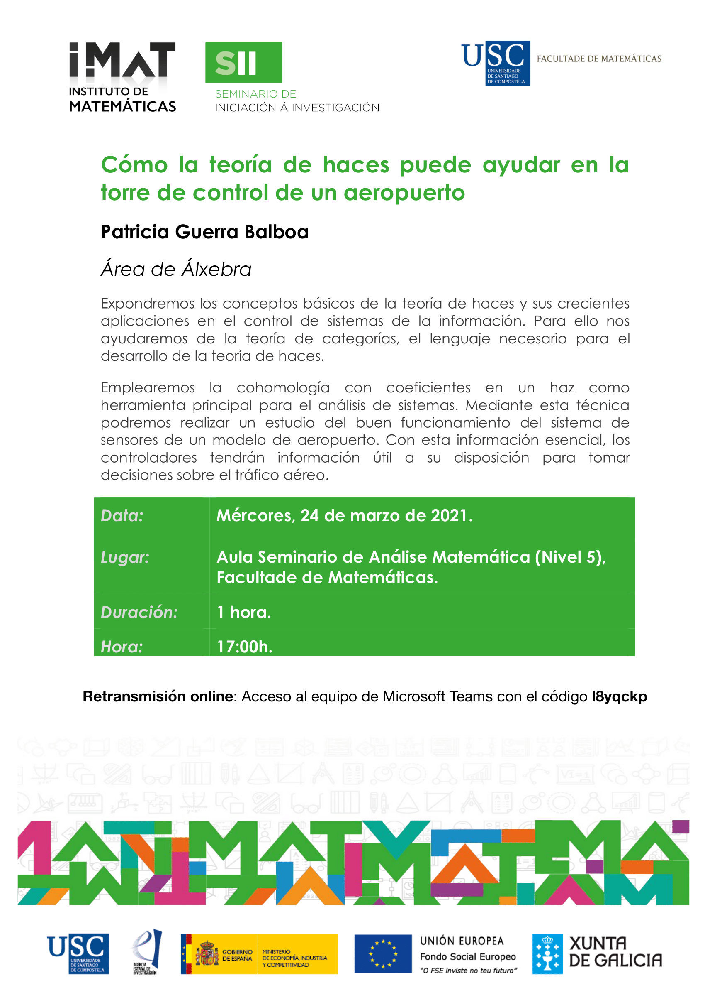

## Invited Talks
<!-- TALK -->

  <!-- Columna izquierda: Q1 logo -->
  

  <!-- Columna derecha: título y autores -->
  

    <strong>
       Balancing Privacy and Utility in Correlated Data
    </strong>

    

         PreMeDICal INRIA Seminar 

    

    <!-- Recursos en cajitas -->
    

      <!-- Universidad -->
      
        📍 Montpellier, France 
      

      <!-- Fecha -->
      
        ⏰ November 2025
      

      <!-- Slides -->
      <a href="../files/BayesianMontpelier_Talk-2-5.pdf" target="_blank" 
      style="background:#23AFA1; color:white; padding:0.2em 0.6em; border-radius:4px; text-decoration:none; font-size:13px; display:flex; align-items:center; gap:0.3em;">
      Slides
    

  

<!-- END TALK -->

<!-- TALK -->

  <!-- Columna izquierda: Q1 logo -->
  

  <!-- Columna derecha: título y autores -->
  

    <strong>
       Balancing Privacy and Utility in Correlated Data: A Study of Bayesian Differential Privacy
    </strong>

    

         51st International Conference on Very Large Data Bases 

    

    <!-- Recursos en cajitas -->
    

      <!-- Universidad -->
      
        📍 London, United Kingdom 
      

      <!-- Fecha -->
      
        ⏰ September 2025
      

      <!-- Slides -->
      <a href="../files/BayesianVLDB_slides.pdf" target="_blank" 
      style="background:#23AFA1; color:white; padding:0.2em 0.6em; border-radius:4px; text-decoration:none; font-size:13px; display:flex; align-items:center; gap:0.3em;">
  Slides
</a>
<!-- Poster -->
      <a href="../files/PosterVLDB2025.pdf" target="_blank" 
      style="background:#23AFA1; color:white; padding:0.2em 0.6em; border-radius:4px; text-decoration:none; font-size:13px; display:flex; align-items:center; gap:0.3em;">
  Poster
</a>
    

  

<!-- END TALK -->

<!-- TALK -->

  <!-- Columna izquierda: Q1 logo -->
  

  <!-- Columna derecha: título y autores -->
  

    <strong>
       Como pueden las matemáticas proteger tu privacidad
    </strong>

    

        Peregrinando: International carrers in mathematics and physics workshop.
    

    <!-- Recursos en cajitas -->
    

      <!-- Universidad -->
      
        📍 CITMaga-University of Santatiago de Compostela 
      

      <!-- Fecha -->
      
        ⏰ December 2024
      

      <!-- Slides -->
      <a href="../files/Peregrinando_2025-1.pdf" target="_blank" 
         style="background:#23AFA1; color:white; padding:0.2em 0.6em; border-radius:4px; text-decoration:none; font-size:13px; display:flex; align-items:center; gap:0.3em;">
        Slides
      </a>
    

  

<!-- END TALK -->

<!-- TALK -->

  <!-- Columna izquierda: Q1 logo -->
  

  <!-- Columna derecha: título y autores -->
  

    <strong>
      Analysis and Measurement of Attack Resilience of Differential
Privacy
    </strong>

    

        23rd Workshop on Privacy in the Electronic Society (WPES’24).
    

    <!-- Recursos en cajitas -->
    

      <!-- Universidad -->
      
        📍 Salt Lake City, USA
      

      <!-- Fecha -->
      
        ⏰ October 2024
      

      <!-- Slides -->
      <a href="../files/wpes_slides.pdf" target="_blank" 
         style="background:#23AFA1; color:white; padding:0.2em 0.6em; border-radius:4px; text-decoration:none; font-size:13px; display:flex; align-items:center; gap:0.3em;">
        Slides
      </a>
    

  

<!-- END TALK -->

<!-- TALK -->

  <!-- Columna izquierda: Q1 logo -->
  

  <!-- Columna derecha: título y autores -->
  

    <strong>
      Composition in Differential Privacy for General Granularity Notions
    </strong>

    

      37th IEEE Computer Security Foundations Symposium
    

    <!-- Recursos en cajitas -->
    

      <!-- Universidad -->
      
        📍 Enschede, The Netherlands
      

      <!-- Fecha -->
      
        ⏰ July 2024
      

      <!-- Slides -->
      <a href="../files/CSF_presentation-1.pdf" target="_blank" 
         style="background:#23AFA1; color:white; padding:0.2em 0.6em; border-radius:4px; text-decoration:none; font-size:13px; display:flex; align-items:center; gap:0.3em;">
        Slides
      </a>
    

  

<!-- END TALK -->

<!-- TALK -->

  <!-- Columna izquierda: Q1 logo -->
  

  <!-- Columna derecha: título y autores -->
  

    <strong>
      Unlocking the potential of composition in DP
    </strong>

    

      Invited talk in the COSIC Seminar 
    

    <!-- Recursos en cajitas -->
    

      <!-- Universidad -->
      
        📍 KU Leuven
      

      <!-- Fecha -->
      
        ⏰ October 2023
      

      <!-- Slides -->
      <a href="https://portal.core.edu.au/conf-ranks/1261/" target="_blank" 
         style="background:#23AFA1; color:white; padding:0.2em 0.6em; border-radius:4px; text-decoration:none; font-size:13px; display:flex; align-items:center; gap:0.3em;">
        Slides
      </a>
    

  

<!-- END TALK -->

<!-- TALK -->

  <!-- Columna izquierda: Q1 logo -->
  

  <!-- Columna derecha: título y autores -->
  

    <strong>
      Publishing Trajectories: A Study on Privacy Protection
    </strong>

    

      XVII Spanish Meeting on Cryptography and Information Security (RECSI22).
    

    <!-- Recursos en cajitas -->
    

      <!-- Universidad -->
      
        📍 University of Cantabria
      

      <!-- Fecha -->
      
        ⏰ October 2022
      

      <!-- Slides -->
      <a href="../files/RECSI22_Slides.pdf" target="_blank" 
         style="background:#23AFA1; color:white; padding:0.2em 0.6em; border-radius:4px; text-decoration:none; font-size:13px; display:flex; align-items:center; gap:0.3em;">
        Slides
      </a>
    

  

<!-- END TALK -->

  <!-- Columna izquierda: Q1 logo -->
  

  <!-- Columna derecha: título y autores -->
  

    <strong>
      Mathematics behind privacy
    </strong>

    

      Invited talk in Seminario García-Rodeja.
    

    <!-- Recursos en cajitas -->
    

      <!-- Universidad -->
      
        📍 CITMaga--University of Santiago de Compostela
      

      <!-- Fecha -->
      
        ⏰ June 2022
      

      <!-- Slides -->
      <a href="../files/maths_behind_privacy__usc_.pdf" target="_blank" 
         style="background:#23AFA1; color:white; padding:0.2em 0.6em; border-radius:4px; text-decoration:none; font-size:13px; display:flex; align-items:center; gap:0.3em;">
        Slides
      </a>
    

  

  <!-- Columna izquierda: Q1 logo -->
  

  <!-- Columna derecha: título y autores -->
  

    <strong>
      Anonymizing Trajectory Data: Limitations and Oportunities
    </strong>

    

      Third AAAI Workshop on Privacy-Preserving Artificial Intelligence (PPAI-22)
    

    <!-- Recursos en cajitas -->
    

      <!-- Universidad -->
      
        📍 Online 
      

      <!-- Fecha -->
      
        ⏰ 	February 2022
      

      <!-- Slides -->
      <a href="../files/paaai.pdf" target="_blank" 
         style="background:#23AFA1; color:white; padding:0.2em 0.6em; border-radius:4px; text-decoration:none; font-size:13px; display:flex; align-items:center; gap:0.3em;">
        Poster
      </a>
    

  

  <!-- Columna izquierda: Q1 logo -->
  

  <!-- Columna derecha: título y autores -->
  

    <strong>
      How sheaves theory can help air-controllers at an airport
    </strong>

    

      Invited talk in S.I.I. (Seminario de iniciación a la investigación).
    

    <!-- Recursos en cajitas -->
    

      <!-- Universidad -->
      
        📍 University of Santiago de Compostela
      

      <!-- Fecha -->
      
        ⏰ March 2021
      

      <!-- Slides -->
      <a href="https://portal.core.edu.au/conf-ranks/1261/" target="_blank" 
         style="background:#23AFA1; color:white; padding:0.2em 0.6em; border-radius:4px; text-decoration:none; font-size:13px; display:flex; align-items:center; gap:0.3em;">
        Slides
      </a>
    

  

